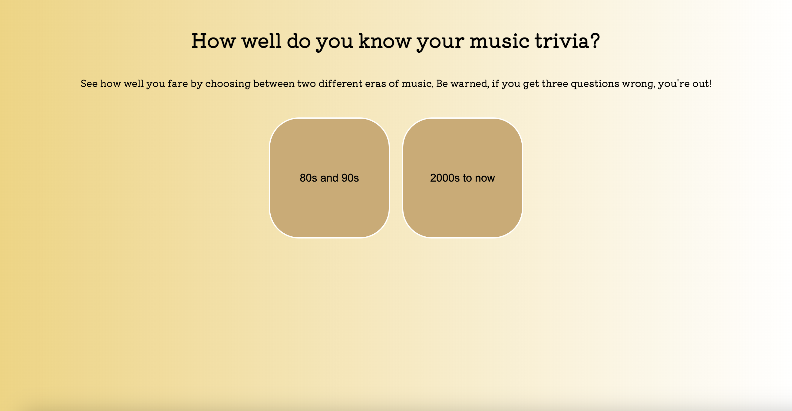

# Music Trivia Quiz
This is a quiz app that allows the player to test their music knowledge in 15 questions. Players choose which era of music they would like to be tested on and if the wrong answer is selected three times, the game ends and the user can try again. 

## Play the game [here][quiz]: 

[quiz]: https://celisawalker.github.io/music-quiz-game-project/

## Attributions
Attributions include Kiwi Maru font hosted on Google Fonts. https://fonts.google.com/share?selection.family=Kiwi+Maru

## Technologies Used
* HTML
* CSS
* Javascript

## Future Plans 
In the future, I would like to add functionality to the answer buttons that changes the color to red or green based on whether or not the player's selection is the correct one. I would also like to add an animation at the end of a winning game to celebrate the player's success. 